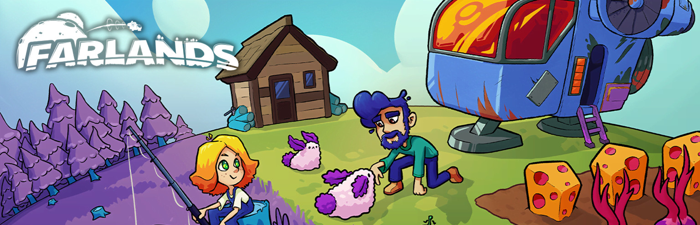

> [!CAUTION]
> **Aviso importante: Bloqueos de LaLiga**  
> El acceso a la web de [Farlands Editor](https://farlands-editor.susodiz.com) podría verse afectado por los **bloqueos** masivos de IP que LaLiga está solicitando a los proveedores de internet en España.  
> 
> Esto se debe a la **_Sentencia de 18 de diciembre de 2024, dictada por el Juzgado de lo Mercantil nº 6 de Barcelona del procedimiento ordinario (Materia mercantil art. 249.1.4)-1005/2024-H instado por la Liga Nacional de Fútbol Profesional y por Telefónica Audiovisual Digital, S.L.U._**
> 
> Si experimentas problemas de inaccesibilidad, te recomendamos intentar acceder mediante una **VPN**, usar **redes alternativas** o ejecutar el editor **localmente**.  
>
> Más información:  
> - [LaLiga - Nota Informativa](https://www.laliga.com/noticias/nota-informativa-en-relacion-con-el-bloqueo-de-ips-durante-las-ultimas-jornadas-de-laliga-ea-sports-vinculadas-a-las-practicas-ilegales-de-cloudflare)
> - [AS: LaLiga ordena bloqueos que afectan a webs y apps legítimas](https://as.com/meristation/betech/ni-steam-ni-x-twitter-laliga-ordena-bloqueos-que-afectan-aleatoriamente-a-webs-y-aplicaciones-n/)
> - [hayahora.futbol - Monitor de bloqueos de LaLiga](https://hayahora.futbol)

> [!WARNING]
> - El desarrollo del editor es muy lento actualmente por falta de tiempo hasta que pueda dedicarle el tiempo que merece.

# Farlands Editor

## 🚀 Acerca del Proyecto

**Farlands Editor** es una herramienta web que te permite modificar tus partidas guardadas del juego Farlands. Con esta aplicación podrás editar diversos aspectos de tu progreso en el juego sin necesidad de usar herramientas complejas o editar archivos manualmente.

## ✨ Características Principales

- 💾 **Carga y guarda** archivos de partidas (.dat) fácilmente con arrastrar y soltar
- 🎮 **Edita múltiples partidas** en un mismo archivo
- 👤 **Modifica datos del jugador** como nombre del personaje y nombre de la granja
- 💰 **Ajusta recursos** como créditos y nivel de energía
- 📈 **Cambia niveles, días y años** de tu partida
- 🌤️ **Altera el clima/estación** del juego
- 🔨 **Mejora el nivel de tus herramientas** (hacha, pico, hoz, azada, regadera)
- 🚀 **Gestiona tu nave espacial** - energía, celdas y progreso de construcción
- 🎒 **Edita tu inventario** - modifica IDs y cantidades de objetos

## ⚠️ Precauciones

- **SIEMPRE haz una copia de seguridad** de tus archivos de guardado antes de modificarlos.
- Algunas modificaciones podrían causar inestabilidad en el juego si se establecen valores inválidos.
- Este editor no es una herramienta oficial y se proporciona "tal cual".

## 🛠️ Guía de Uso

1. **Carga tu archivo de guardado**:
   - Haz clic en el área de carga o arrastra y suelta tu archivo `.dat` de Farlands.
   - El editor validará que el archivo tenga el formato correcto.

2. **Selecciona una partida**:
   - Si el archivo contiene múltiples partidas, selecciona la que quieras editar.
   - Solo podrás editar partidas que ya hayan sido iniciadas en el juego.

3. **Edita tus datos**:
   - Navega entre las diferentes pestañas para editar distintos aspectos del juego.
   - Puedes modificar características básicas, niveles de herramientas, datos de la nave y tu inventario.

4. **Guarda tus cambios**:
   - Haz clic en "Guardar Cambios" para aplicar las modificaciones.
   - Usa "Descargar Archivo" para obtener el archivo modificado.

5. **Reemplaza tu archivo original**:
   - Sustituye tu archivo de guardado original por el modificado.
   - ¡Inicia el juego y disfruta de tus cambios!

## 🔄 Tema Claro/Oscuro

El editor incluye un selector de tema que te permite cambiar entre modo claro y oscuro según tus preferencias. El tema se guardará en tu navegador para futuras sesiones.

## 🧑‍💻 Desarrollo

Este proyecto está desarrollado con tecnologías web estándar:
- HTML5
- CSS3
- JavaScript (Vanilla)

No requiere ninguna dependencia externa ni proceso de compilación.

## 📝 Licencia

Este proyecto está bajo la **GNU General Public License v3.0** - ver el archivo [LICENSE](LICENSE) para más detalles.

---

  
Desarrollado con ❤️ para la comunidad de Farlands

  <a href="https://susodiz.com/">☄️SusoDiz™</a>

